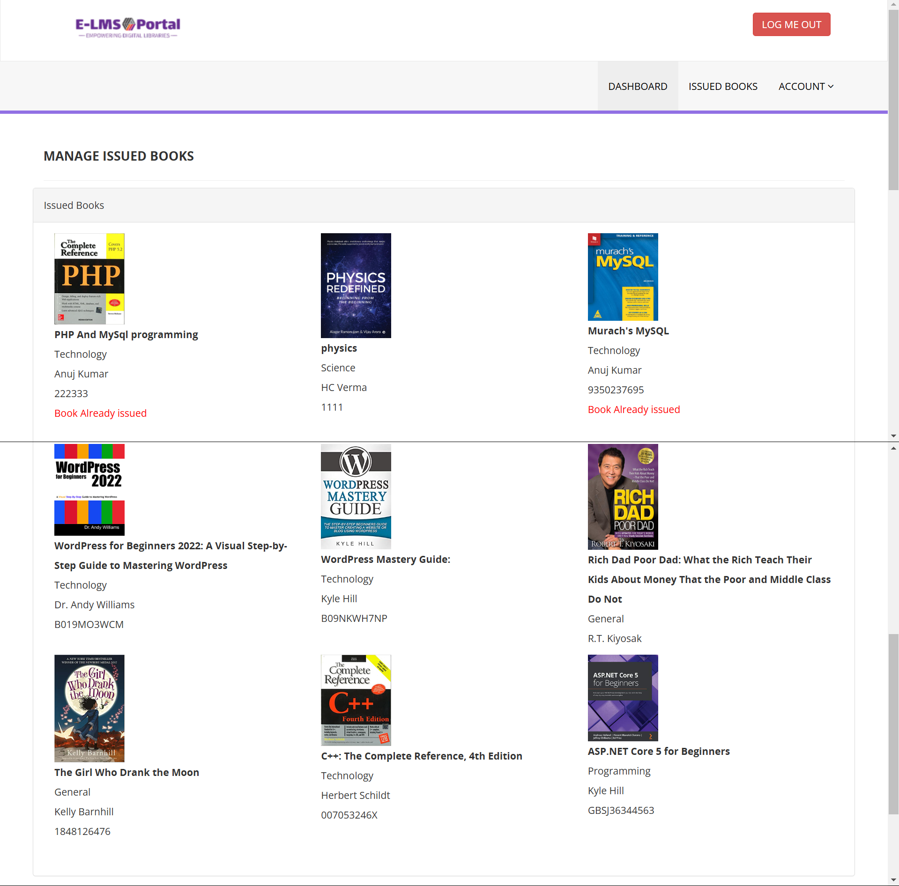

# About This Project

## **E-Library Management System Portal - Introduction**

The Library Management System (LMS) is a web-based application developed using PHP and MySQL. The primary aim of this project is to digitize and streamline the daily operations of a library, making it easier to manage and maintain records. Unlike conventional library management systems, this project offers advanced features like user and admin login facilities.

Through the admin login, the administrator can monitor and manage the entire system, ensuring smooth operations. Students, after logging in, can view a list of books they've borrowed, along with details such as issue dates and return dates.

This system improves the overall library experience by allowing efficient tracking and management of books and student activities.

---

## **E-LMS Portal Requirements**

- **Project Name**: E-Library Management System Portal
- **Languages Used**: PHP 5.6, PHP 7.x
- **Database**: MySQL 5.x
- **User Interface Design**: HTML, AJAX, jQuery, JavaScript
- **Supported Web Browsers**: Mozilla Firefox, Google Chrome, Internet Explorer 8+, Opera
- **Software Required**: XAMPP / WAMP / MAMP / LAMP (Any one)

---

## **E-LMS Poral Project Modules**

The E-LMS is divided into two main modules:

1. **Student Module**
2. **Admin Module**

---

### **Admin Features**

The admin has full control over the system and can perform various tasks through the Admin Dashboard, including:

- **Admin Dashboard**: A centralized interface to manage the system.
- **Category Management**: Admin can add, update, or delete book categories.
- **Author Management**: Admin can add, update, or remove authors.
- **Book Management**: Admin can add, update, or delete books from the library's inventory.
- **Book Issuing**: Admin can issue new books to students and update the status when a book is returned.
- **Student Management**: Admin can search for students using their Student ID and view detailed student information.
- **Password Management**: Admin can change their own password.

---

### **Student Features**

Students can interact with the LMS through their personal accounts and perform the following actions:

- **Student Registration**: Students can register on the system to create their account, which provides them with a unique Student ID.
- **Student Dashboard**: After logging in, students can access their personal dashboard.
- **Browse Library**: Students can view a list of all available books in the library.
- **Profile Management**: Students can update their profile information.
- **Issued Books**: Students can view a list of books they've borrowed, including details such as the issue date and the expected return date.
- **Password Management**: Students can change or recover their passwords.

---

## **Project Output Screenshots**

Here are some screenshots that showcase the various pages of the Library Management System:

### **1. Home Page**

The home page provides a user-friendly interface for easy navigation across the system.

---

### **2. Student Dashboard**

After logging in, students are greeted with their dashboard where they can access all their features and view borrowed books.

---

### **3. Listed Books**

Students can browse the list of books available in the library and check out details such as titles, authors, and availability.

---

### **4. Admin Dashboard**

The Admin Dashboard allows the admin to manage books, students, and other system resources efficiently.

---

### **5. Other Snapshots of Portal**

  
